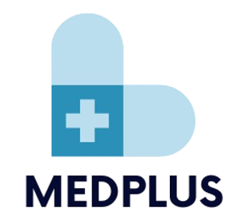

<div align="center" >
  
</div>

---

[](https://git.io/typing-svg)

---

### 🚀 MedPlus: Revolutionizing Healthcare

MedPlus is an innovative hospital management system designed to provide **seamless patient care** and **streamline doctor-patient interactions**. Whether you're a patient seeking medical attention or a doctor managing appointments and prescriptions, MedPlus makes healthcare more accessible and efficient. Join us in building the future of healthcare today!
#### To access Doctor role:
email: sarahwilson@gmail.com
password: maledoctor@abc

#### To access Admin role:
email: xyz@gmail.com
password: maleadmin@xyz

---

#### Features for Patients:
- 📅 **Effortless Appointment Scheduling:** Patients can easily book appointments with doctors, selecting the desired time and date from the available slots.
- ⏰ **Real-time Appointment Tracking:** Stay updated with upcoming appointments and any changes.
- 📄 **Medical History:** Patients can view a detailed record of their visits, including prescriptions and treatment history.
- 📱 **Accessibility:** Available anytime, anywhere, on your mobile or desktop device.

#### Features for Doctors:
- 🗓️ **Appointment Management:** View and manage your scheduled appointments with ease.
- 💊 **Prescription Tracking:** Quickly update prescriptions, keeping a complete health record for each patient.
- 👩‍⚕️ **Patient Information:** Access patient medical records to provide personalized care.
- 🛠️ **Digital Tools:** Use advanced tools for diagnosing, recommending, and interacting with patients efficiently.

---

## 🛠️ Technologies & Tools:

### We have used following tools:
<div style="display: flex; gap: 10px; align-items: center;">


&nbsp;&nbsp;

&nbsp;&nbsp;

&nbsp;&nbsp;

&nbsp;&nbsp;

&nbsp;&nbsp;

&nbsp;&nbsp;

&nbsp;&nbsp;

&nbsp;&nbsp;
</div>


---

This is a [Next.js](https://nextjs.org/) project bootstrapped with [`create-next-app`](https://github.com/vercel/next.js/tree/canary/packages/create-next-app).

## Getting Started

To get started with the MedPlus project, follow these steps:

1. First, run the development server:
   ```bash
   npm run dev
   # or
   yarn dev
   # or
   pnpm dev
   # or
   bun dev
